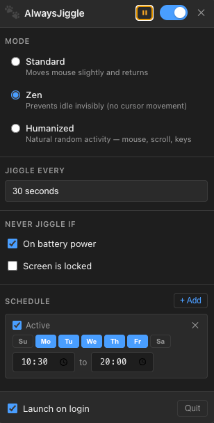

# AlwaysJiggle



A macOS menu bar app that keeps your machine awake and your status green — no more "away" on Slack or Teams while you step away for coffee.

---

## Features

- **Standard mode** — nudges the mouse cursor by 2px and back every N seconds (requires Accessibility permission)
- **Zen mode** — keeps the display awake and resets the idle timer via a native macOS API, with no cursor movement and no Accessibility permission required
- **Humanized mode** — irregular timing with randomized bursts, breaks, and idle phases to mimic real human activity
- **Schedules** — configure active days and time windows (e.g. Mon–Fri, 9am–5pm)
- **Smart pausing** — auto-pauses on battery, on lock screen, or for a timed duration (15 min / 1 hour / until tomorrow)
- **Launch on login** — starts automatically with macOS

---

## Download

Go to the [Releases](../../releases) page and download the latest `.dmg` for Apple Silicon (arm64).

### "AlwaysJiggle is damaged and can't be opened"

Because the app isn't notarized with an Apple Developer certificate, macOS Gatekeeper will block it. Run this once in Terminal after moving it to Applications:

```sh
xattr -cr /Applications/AlwaysJiggle.app
```

Then open it normally.

---

## Running locally

### Prerequisites

- Node.js 18+
- npm
- macOS (Apple Silicon recommended)
- Xcode Command Line Tools (for the Swift helper)

### Setup

```sh
git clone https://github.com/ncesar/AlwaysJiggle.git
cd AlwaysJiggle
npm install
```

### Compile the Swift helper

The native helper binary is already compiled and committed at `helpers/jiggle-helper`. If you need to recompile it:

```sh
swiftc helpers/jiggle-helper.swift -o helpers/jiggle-helper
```

### Start in development

```sh
npm start
```

This compiles TypeScript and launches Electron. The app will appear in your menu bar.

### Build a distributable `.dmg`

```sh
npm run dist
```

The output is placed in the `release/` folder.

---

## Project structure

```
src/
  main/
    index.ts          # App entry, IPC handlers
    tray.ts           # Menu bar tray + popup window
    jiggleEngine.ts   # Start/stop/pause/resume orchestration
    humanEngine.ts    # Humanized timing state machine
    conditions.ts     # Battery and lock screen monitoring
    scheduler.ts      # Schedule evaluation
    store.ts          # Persistent settings (electron-store)
    preload.ts        # Context bridge for renderer IPC
    types.ts          # Shared TypeScript interfaces
  renderer/
    index.html        # Popup UI
    renderer.ts       # UI logic and state binding
    style.css         # Styles
helpers/
  jiggle-helper.swift # Native Swift binary (mouse, zen, idle)
```

---

## Contributing

Contributions are welcome. A few guidelines:

1. Fork the repo and create a branch from `main`
2. Keep changes focused — one feature or fix per PR
3. Run `npm start` to verify nothing is broken before opening a PR
4. Open a PR with a clear description of what and why

If you find a bug or have a feature idea, open an issue first so we can discuss it.

---

## About the developer

Built by [César Nascimento](https://linkedin.com/in/cesarnascimentoo), a fullstack developer. Feel free to connect.

---

## License

MIT
